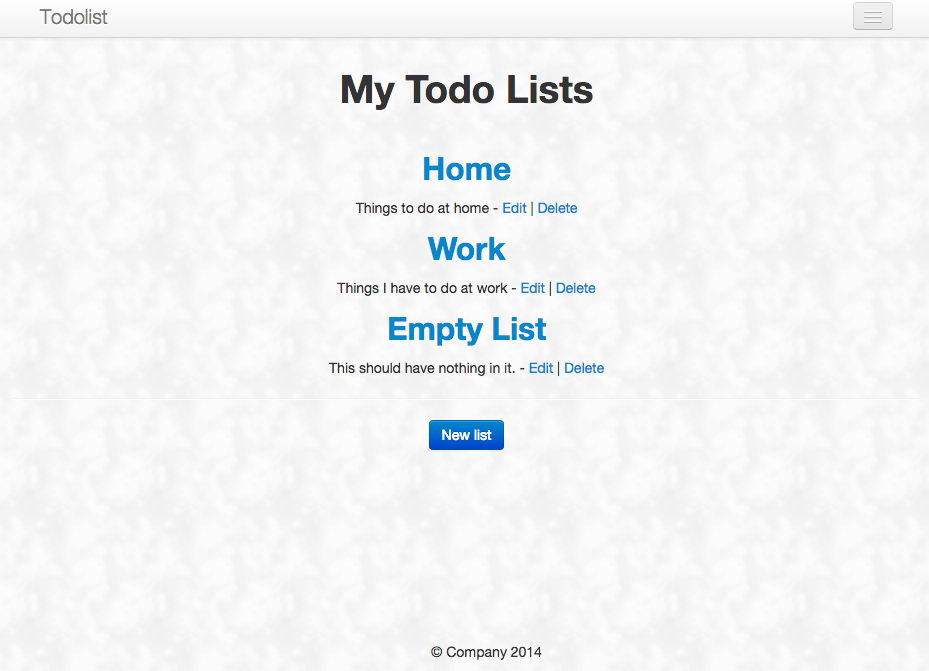

## Simple Rails To Do List

## Summary

Simple Rails To Do List is a to do list built entirely on Ruby on Rails. This was one of the first web apps I made entirely utilizing Ruby on Rails with the help of [Robin Fisher's Tutorial] (http://vimeo.com/11436026).

Built with straight up HTML / CSS / Bootstrap on the frontend and Ruby on Rails on the backend.

Hosted on Heroku.

---
Developed by [Matthew Day] (http://unlimitedday.com)